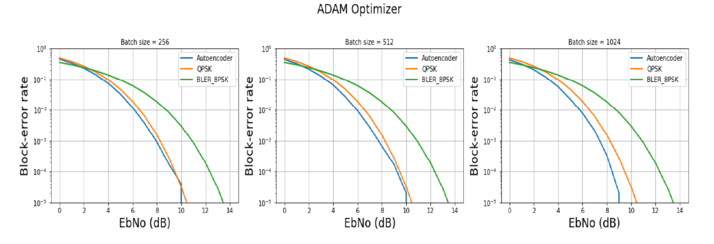
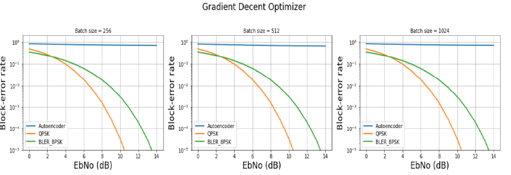
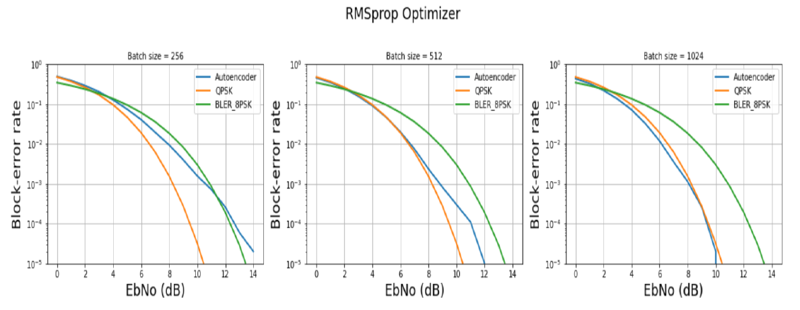

## Understanding the Problem

Throughout the years we have achieved numerous discrete ways to communicate over a channel allowing efficient operations at specific SNR (Signal to Noise Ratio) values. Rate matching and code adaptation has allowed us to come up with different ways to establish a reliable communication channel, but many of them are computationally complex in practice and require expensive hardware or DSP software to leverage in mobile radio systems.

By taking the approach of self-supervised learning of an end-to-end communications system by optimization of reconstruction cost in a channel auto-encoder, we seek to learn new methods of modulation which blur the lines between modulation and error correction, providing similar SNR to bit error rate performance (BER) while achieving lower computational complexity requirements at runtime. The potential impact of such a system on the development, deployment and capabilities of wireless systems holds enormous potential.

## Goals:
1. To train an Autoencoder for Information Transmission at different hyperparameter tunings and represent it as a standalone end-to-end communication system.
2. To build the parts of the Autoencoder such that they replace the components of a conventional communication system.
3. Performing Hyperparameter tuning to ensure optimal reconstruction of outputs.
4. Comparing the performance with different Modulation Schemes.

## Results using different optimizers:

### Adam

### Gradient Decent

### Adam

## Comparison:

| Optimizer      | ADAM | Gradient Decent      | RMSprop |
| ----------- | ----------- | ----------- | ----------- |
| Learning      | fast       | slow      | fast       |
| Stability   | stable        | stable   | fluctuating        |  
| Performance   | good        | Bad   | good        |  
| Overall   | best        | bad   | ok        |  
